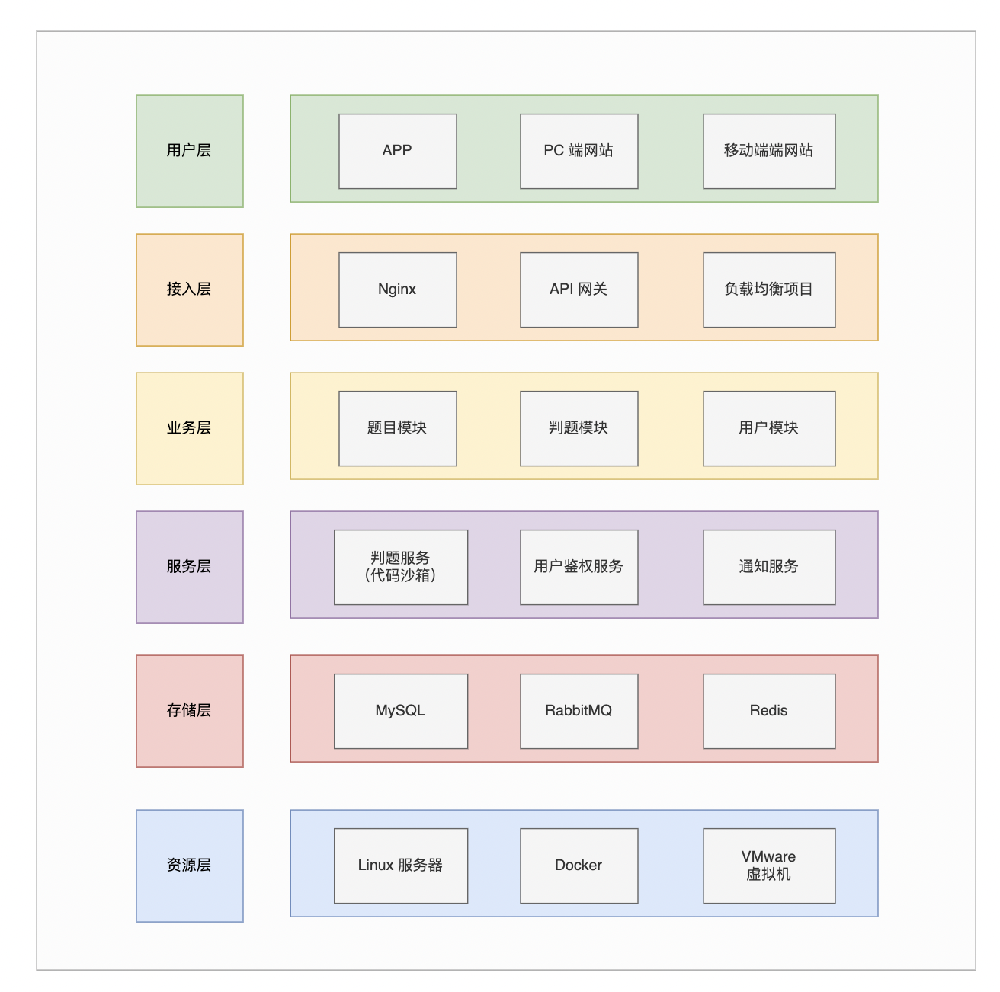

# DOJ Online Judge

## 项目介绍

### 简介

- 基于 Spring Cloud 微服务、Spring Boot、Docker、 Vue 的在线编程平台。
- 系统功能：管理员可以创建、管理题目。用户可以搜索题目、浏览题目、编写并提交代码、查看判题结果。
  - 题目内容：包括题目描述、判题条件、题目输入和输出、题目示例和题目用例（用于判题，仅管理员可查看）
  - 系统后端：根据管理员预设的题目测试用例在自主实现的代码沙箱中对代码进行编译、运行、判断输出结果。
  - 代码沙箱：可作为独立服务，提供给开发者使用（可与 API 接口开放平台结合 https://github.com/Manson-chen/api-platform-backend）

> 在线访问地址：http://doj.valechat.site/
>
> （旧：http://62.234.8.36:8100/）
>
> 管理员账号：jiandong，密码：abc123456

## 技术选型与架构设计

### 前端技术栈

- Vue3
- Arco Design

### 后端技术栈

- Spring Boot
- Spring Cloud Alibaba
  - Nacos、Spring Cloud Gateway、Sentinel

- Docker
- MySQL
- MyBatis Plus
- Redis
- RabbitMQ
- 设计模式
- Java 进程控制、Java 安全管理器、JVM 部分知识
- VMware 虚拟机

## 架构设计

​	

## 功能介绍

根据服务划分业务功能

### 用户服务

1. 注册
2. 登录
3. 用户管理

### 题目服务

1. 创建题目（管理员）
2. 删除题目（管理员）
3. 修改题目（管理员）
4. 搜索题目
5. 在线做题
6. 提交题目

### 判题服务

1. 执行判题逻辑（异步实现）
   - 根据判题条件、判题用例 和 错误处理（内存溢出、安全性、超时）进行判题
2. 代码沙箱实现（独立的服务、提供开放接口调用）

## 项目成果

### 用户模块

​	

​	

​	Tips：用户中心暂时仅支持用户名修改

​	

### 题目和判题模块

#### 浏览题目

​	

#### 浏览题目提交

​	

#### 	创建题目

​	

#### 管理题目

​	

#### 在线做题和提交题目

​	

## 后续扩展

1. 完善代码沙箱，实现更多编程语言支持（包括 C++、C、Go、Python 等）。
2. 增加调用POJ、AtCoder、SPOJ、HDU 等远程代码评测的功能。
3. 完善评测功能：交互评测、特殊评测等。
4. 完善系统功能：包括用户中心、题目交流、题解分享等功能。
5. 完善系统细节，如提交代码后，判题结果在做题页面的显示等
   - 给每道题添加对应的类名和需实现的方法名（题目表添加对应字段）
   - 编译两个代码文件：一个是用户代码，另一个是 main 函数处理测试用例的输入 和 调用用户实现的方法。对用户隐藏 mian 函数获取测试用例等逻辑的代码。

## 快速开始

1. 配置相关库：MySQL、Redis、RabbitMQ、Nacos
2. 创建数据库和表：创建 sql 中的所有表
3. 待补充。。。
